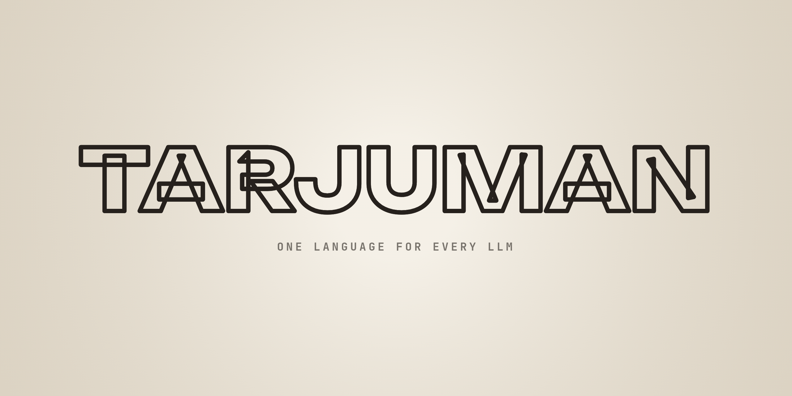

# Tarjuman

One neutral language for every LLM provider. Send the same conversation to Anthropic,
OpenAI, DeepSeek, a local vLLM or anything else, and switch models mid-conversation
without losing reasoning, tool calls or signatures.

> A *tarjuman* (ترجمان) was the interpreter who stood between courts, merchants and
> travellers and made every language understood. English got *dragoman* from it.
> In the old *diwan*, the register office, the tarjuman was the one who spoke to everyone.

**Status:** two protocols work: OpenAI Chat Completions (OpenRouter, OpenAI, DeepSeek, vLLM
and other compatible servers) and Anthropic Messages, with switching between them mid-conversation
(thinking signatures kept, foreign reasoning sent as text). The format is specified in
[docs/format.md](docs/format.md). Provider quirks are data (`data/providers.json`), and a model
catalog generated from [models.dev](https://models.dev) (`scripts/update_catalog.py`) supplies
limits, vision, each model's reasoning levels and prices. `tests/fixtures/` holds
language-neutral golden files any port must pass. Tarjuman is the provider layer of
[Diwan](https://github.com/Zine-Elabidine/diwan), but knows nothing about it and is meant to be
used on its own.

## Scope

Tarjuman turns **one request into one response**. It does not run agent loops, execute tools
or store conversations: that's the caller's job.

- **A neutral format.** Messages are lists of typed blocks (`text`, `reasoning`, `image`,
  `tool_call` with raw arguments, `tool_result`). Every assistant message records the
  `provider` and `model` that produced it, its `usage`, and an opaque `replay` envelope for
  provider-private data (thinking signatures, encrypted reasoning).
- **Switching models is safe.** Before each request, history is adapted to the target:
  reasoning from another model becomes text, encrypted reasoning is dropped, tool-call ids are
  rewritten to what the target accepts, images become placeholders for models without vision,
  failed turns are skipped, and tool calls without results get a synthetic error.
- **Protocol, provider and model are separate.** A few wire protocols (OpenAI Chat
  Completions and Anthropic Messages first; Gemini and OpenAI Responses later) serve many
  providers. Provider quirks (`max_tokens` field names, how reasoning is turned on, roles) are
  data in a compat table, not branches in code.
- **One stream vocabulary.** Every provider yields the same events: block start, text,
  reasoning and tool-call deltas, block end, usage, finish.
- **Comparable usage.** Tokens are split into uncached input, cache read, cache write, output
  and reasoning, with cost from the catalog.
- **Stable errors.** `RATE_LIMIT`, `CONTEXT_WINDOW_EXCEEDED`, `INVALID_CREDENTIAL`... with a
  retry policy owned by each provider's config.
- **A catalog generated from [models.dev](https://models.dev)** plus small overrides.
- **Few dependencies.** An HTTP client, and that's it.

## Prior art

The design follows [pi-ai](https://github.com/badlogic/pi-mono/tree/main/packages/ai)
(TypeScript), especially its cross-provider message transform and compat tables, and the
provider layer of [DeepSeek Harness](https://github.com/deepseek-ai/deepseek-harness).

## License

MIT
